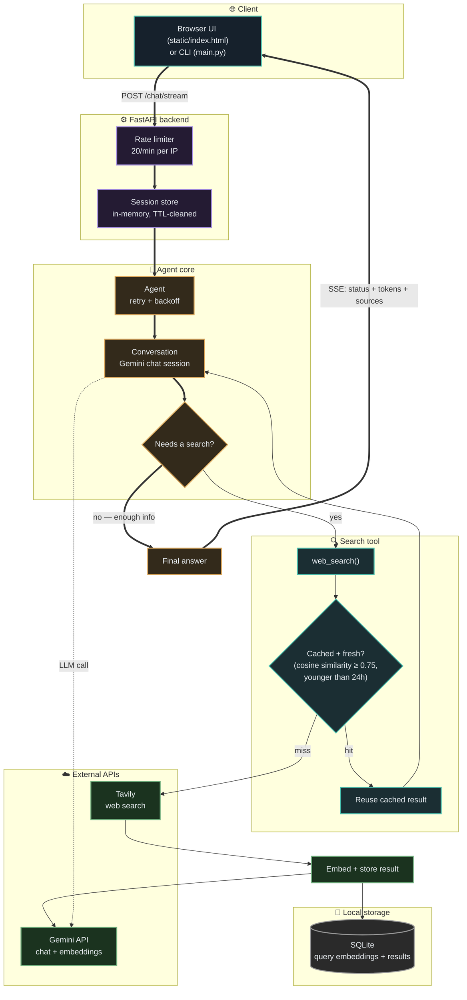

# Delve

**🔗 Live demo: [delve-api-46ef.onrender.com](https://delve-api-46ef.onrender.com)** — open it, ask it something, no setup required.

**An agentic, conversational research engine that searches, remembers, and cites its sources.**

Delve isn't a search-and-summarize script. It's an LLM agent that decides for itself *when* a question needs a live web search, iterates on its own queries if the first search isn't enough, remembers context across a conversation, builds a growing local knowledge base as it's used, and can export any research session into a clean, cited markdown report.

```
you> what are electric vehicle tax credits in 2026?

  🔍 searching: electric vehicle tax credits 2026 IRS 30D
  🔍 searching: One Big Beautiful Bill Act EV tax deduction 2026

╭─────────────────────────────── Delve ───────────────────────────────╮
│ The federal EV tax credit landscape changed significantly following │
│ the One Big Beautiful Bill Act (OBBBA)...                           │
╰───────────────────────────────────────────────────────────────────╯

you> what about the used EV credit?

╭─────────────────────────────── Delve ───────────────────────────────╮
│ The $4,000 used EV credit (Section 25E) also expired for vehicles   │
│ acquired after September 30, 2025...                                │
╰───────────────────────────────────────────────────────────────────╯

you> export
Saved report to reports/delve_report_20260730_210806.md
```

---

## Why this exists

Most "AI search" demos are a single API call wrapped in a prompt: stuff some search results into context, ask the model to summarize, done. Delve is built differently — it's an **agent with a tool**, not a pipeline with a fixed shape. The model itself decides whether a question needs external information, how to phrase the search, whether one search was enough or it needs to dig further, and it does all of this while holding a real conversation and building a persistent memory of what it's already learned.

That distinction — agent-directed tool use vs. a fixed retrieve-then-generate pipeline — is what makes this closer to how tools like Perplexity actually work under the hood, rather than a toy RAG demo.

---

## Features

- 🔎 **Agentic web search** — the model decides on its own when a question needs current information, and searches only then (not on every message)
- 🔁 **Multi-hop research** — if one search isn't enough, the agent refines its query and searches again, up to a configurable limit
- 💬 **Multi-turn memory** — follow-up questions ("what about the second one?") correctly resolve against earlier context
- 💾 **Local semantic cache** — every search result is embedded and cached; semantically similar future questions ("EV incentives" vs. "electric vehicle tax credits") reuse cached results instead of burning another API call
- 📄 **Exportable reports** — turn any research session into a clean markdown document with a deduplicated, properly cited sources list
- 🛡️ **Resilient by design** — automatic retry with backoff on transient API failures, rate limiting, idle-session cleanup
- 💸 **Runs entirely on free tiers** — no paid API or hosting required for any component

---

## Architecture



The core design principle: **the LLM is the orchestrator, not the pipeline.** Gemini decides when to call the search tool and when it has enough information to stop — including calling it multiple times in a row to refine a query — via the Gemini API's native function-calling (tool-use) support, not hand-written control-flow logic. The thick arrows trace the primary request path (client → rate limiter → session → agent → answer → stream back); the thinner arrows are the conditional search/cache branch the agent takes only when it decides it needs to.

---

## Tech stack

| Layer | Technology | Why |
|---|---|---|
| Language | Python 3.12 | |
| LLM / agent reasoning | [Google Gemini API](https://ai.google.dev) (`gemini-3.5-flash-lite`) | Free tier, native function calling, strong reasoning-to-cost ratio |
| Web search | [Tavily API](https://tavily.com) | Purpose-built for LLM agents — clean, pre-extracted content instead of raw HTML |
| Embeddings | Gemini API (`gemini-embedding-001`) | No local ML model or PyTorch — keeps memory footprint small enough for free-tier hosting, uses the same Gemini key already required elsewhere |
| Local storage | SQLite | Zero-config persistent cache for the growing knowledge base |
| CLI / UX | [rich](https://github.com/Textualize/rich) | Formatted panels, live status spinners, clean terminal output |
| Web API | [FastAPI](https://fastapi.tiangolo.com) + [uvicorn](https://www.uvicorn.org) | Session-based HTTP access to the same agent that powers the CLI |
| Rate limiting | [slowapi](https://github.com/laurentS/slowapi) | Protects free-tier Gemini/Tavily quotas from abuse |
| Hosting | [Render](https://render.com) | Free web service tier, no credit card, runs a real persistent process |
| Config | python-dotenv | Environment-based secrets management, keys never touch source control |

No paid services, no cloud infrastructure, no framework overhead — every dependency is doing real, necessary work.

---

## Project structure

```
delve/
├── main.py                    # CLI entry point
├── api.py                     # FastAPI backend + serves the frontend
├── static/
│   └── index.html              # single-file chat UI, served at "/"
├── config.py                  # env vars, model settings, validation
├── logging_config.py          # structured logging setup
├── render.yaml                 # Render deployment blueprint
├── requirements.txt
├── requirements-dev.txt        # test/lint/type-check tooling
├── pyproject.toml              # ruff, mypy, pytest config
├── playground.ipynb           # scratch notebook for experimentation only
├── tests/                      # automated test suite (mocks all external APIs)
├── .github/workflows/ci.yml    # lint + type-check + test on every push
└── src/
    ├── cli.py                 # interactive REPL: commands, formatting, I/O
    ├── agent.py                # Agent class — owns the conversation, handles retries
    ├── tools/
    │   └── search.py           # web_search tool factory: checks cache, falls back to Tavily
    ├── memory/
    │   └── conversation.py     # wraps a persistent Gemini chat session
    ├── storage/
    │   ├── embeddings.py       # embedding calls via the Gemini API
    │   └── cache.py             # SQLite-backed semantic cache
    └── reports.py               # builds exportable markdown reports + citations
```

---

## Getting started

### 1. Clone and set up a virtual environment

```bash
git clone https://github.com/RockYash9/delve.git
cd delve
python -m venv .venv
source .venv/bin/activate        # Windows: .venv\Scripts\Activate.ps1
```

### 2. Install dependencies

```bash
pip install -r requirements.txt
```

### 3. Get free API keys (no credit card required for either)

| Key | Where to get it | Free tier |
|---|---|---|
| `GEMINI_API_KEY` | [aistudio.google.com](https://aistudio.google.com) | Generous daily request limit |
| `TAVILY_API_KEY` | [tavily.com](https://tavily.com) | 1,000 searches/month |

```bash
cp .env.example .env
# then edit .env and paste in both keys
```

### 4. Run it

```bash
python main.py
```

**Note:** `jupyter` (used by the optional scratch notebook) is dev-only — install `requirements-dev.txt` if you want it. It's not needed to run the app.

---

## Usage

Once running, just type a question. A few built-in commands:

| Command | What it does |
|---|---|
| `help` | List all available commands |
| `reset` | Start a fresh conversation — clears conversational memory, but keeps the accumulated knowledge cache |
| `export` | Save the current conversation as a markdown report (transcript + cited sources) to `reports/` |
| `exit` / `quit` | Leave |

---

## Web API

Alongside the CLI, the same agent is also reachable over HTTP — this is what powers the deployed live demo.

```bash
uvicorn api:app --reload
```

Interactive docs (auto-generated by FastAPI) at `http://127.0.0.1:8000/docs`.

| Endpoint | Method | Purpose |
|---|---|---|
| `/chat` | POST | Send a message, get the full reply at once. Include `session_id` to continue an existing conversation, or omit it to start a new one (the response includes the `session_id` to reuse) |
| `/chat/stream` | POST | Same as `/chat`, but streams the reply as it's generated via Server-Sent Events — see below |
| `/reset` | POST | Clear a session's conversation memory |
| `/export/{session_id}` | GET | Get the session's conversation as a markdown report with sources |
| `/health` | GET | Liveness check — also reports `active_sessions` count |

```bash
curl -X POST http://127.0.0.1:8000/chat \
  -H "Content-Type: application/json" \
  -d '{"message": "what are electric vehicle tax credits in 2026?"}'
```

### Streaming

`/chat/stream` sends structured Server-Sent Events instead of one final blob — search status arrives in true real time, and the answer text is delivered in word-sized chunks for a live-typing feel. (It's not raw network-level token streaming — see "Known limitations" for why; Gemini's real streaming is currently unreliable once a tool call is involved, so this gets the complete correct answer first, then delivers it incrementally.)

```
data: {"type": "session", "session_id": "..."}
data: {"type": "status", "text": "🔍 searching: electric vehicle tax credits 2026"}
data: {"type": "token", "text": "The"}
data: {"type": "token", "text": " federal"}
data: {"type": "token", "text": " EV tax credit..."}
data: {"type": "sources", "sources": [...]}
data: {"type": "done"}
```

It's a POST endpoint rather than the browser-native `EventSource` (which only supports GET) — a request body is needed per call, so the frontend consumes this with `fetch()` and a stream reader instead, a standard pattern for SSE-over-POST.

**A note on isolation**: each session gets its own agent instance and its own search-citation tracking — one user's conversation and sources never leak into another's, even when many sessions run concurrently.

---

## Frontend

A single-file chat UI (`static/index.html`) — plain HTML/CSS/JS, no build step, no framework. FastAPI serves it directly at `/`, so running `uvicorn api:app` gives you both the API and a working chat interface at the same address — one service, not two. It renders search activity as a live "depth gauge" that lights up per search, streams the answer in, shows a collapsible sources list when the agent searched, and displays an honest "waking up" banner if the backend is cold-starting.

---

## How the semantic cache works

Every time the agent searches the web, the query and result are embedded via the Gemini API and stored in SQLite. On future searches, the new query is embedded and compared against everything previously cached using cosine similarity. If something sufficiently close (similarity ≥ 0.75) and still fresh (younger than `CACHE_TTL_HOURS`) already exists, it's reused instantly instead of spending a Tavily API call — meaning **the tool gets faster and cheaper to run the more you use it**, and accumulates a genuine local knowledge base over time rather than staying purely a stateless search wrapper.

---

## Development

This project uses automated tests, linting, and type checking — a GitHub Actions workflow (`.github/workflows/ci.yml`) runs all three on every push.

```bash
pip install -r requirements-dev.txt

pytest -v          # run the test suite
ruff check .        # lint
mypy .               # type check
```

Tests mock all external APIs (Gemini, Tavily, embeddings) — the suite runs fully offline and never needs real API keys or network access, so it's safe to run in CI or anywhere else.

Logs are written to `logs/delve.log` (rotated automatically) — useful for understanding agent behavior after the fact, separate from the live terminal UI.

---

## Deployment

**Live now at [delve-api-46ef.onrender.com](https://delve-api-46ef.onrender.com)** — deployed as a single, free Render web service. The backend serves the frontend itself, so it's one URL and one service, not two separate deployments to keep in sync. Pushing to `main` redeploys automatically.

Want to deploy your own copy? Full walkthrough in [`DEPLOYMENT.md`](./DEPLOYMENT.md).

**Honest tradeoffs of free hosting** (not hidden — designed around):
- Render's free tier sleeps the service after ~15 minutes idle; the first request after that takes 20-50s to wake back up. The frontend shows a "waking up" banner during that window instead of leaving you staring at nothing.
- The free tier's filesystem is ephemeral — the SQLite knowledge cache resets on every redeploy/restart rather than persisting indefinitely. See Known limitations.

---

## Production settings

All configurable via environment variables (see `.env.example`), all with sensible defaults:

| Setting | Default | What it does |
|---|---|---|
| `RATE_LIMIT` | `20/minute` | Applied to `/chat` and `/chat/stream` (the endpoints that call Gemini/Tavily) — protects the free-tier quotas from accidental loops or abuse. `/health` and `/export` are unlimited. |
| `CACHE_TTL_HOURS` | `24` | How long a cached search result stays eligible for reuse before it's treated as stale and a fresh search happens instead. |
| `SESSION_IDLE_TTL_MINUTES` | `120` | How long an API session can sit idle before it's purged, capping memory growth on a long-running server. Purged lazily on the next new session lookup, not via a background scheduler. |
| `ALLOWED_ORIGINS` | `*` | CORS allowlist. Since the frontend and backend share one origin in this deployment, this mostly doesn't come into play — tighten it if you ever split them across two domains. |

## Known limitations

- **No authentication on the deployed instance** — it's protected only by rate limiting, not per-user auth. Fine for a personal/portfolio project with one shared free-tier quota; not multi-tenant production-ready as-is.
- **Sessions live in a single process's memory** — this deployment intentionally runs as one instance, so that's not a problem today, but it means session state wouldn't survive horizontal scaling (multiple server instances) without moving to shared/persistent session storage first.
- **The SQLite cache doesn't persist across Render redeploys** — the free tier's filesystem is ephemeral, so `delve_cache.db` resets to empty each time the service restarts or redeploys. The cache still works great *within* a running instance's lifetime; it just doesn't survive a redeploy the way it would on your own machine or a host with a persistent disk.
- **Render's free tier cold start**: ~20-50s delay on the first request after ~15 minutes of inactivity. Handled gracefully in the UI (a "waking up" banner), not hidden, but real.
- The cache's similarity threshold (0.75) was originally tuned against a different embedding model (local sentence-transformers) before the switch to Gemini's embedding API for memory reasons — it's a reasonable starting point but hasn't been re-validated against Gemini's embedding space specifically. Watch cache hit/miss behavior in practice and adjust `SIMILARITY_THRESHOLD` in `src/storage/cache.py` if it seems too strict or too loose.
- Gemini's free-tier models are occasionally retired or renamed by Google with little notice — if you hit a `404` on the configured model, check [ai.google.dev/gemini-api/docs/changelog](https://ai.google.dev/gemini-api/docs/changelog) and update `MODEL_NAME` in `config.py`.
- **Gemini's raw streaming API is unreliable with tools attached**: `gemini-3.5-flash` has a confirmed bug (mid-2026) where combining true token streaming with automatic function calling can cause the model's final answer to come back genuinely empty whenever a tool runs mid-response — not just a display glitch, the generation itself stops with no text. Since this agent's search tool is attached to every conversation, that isn't a rare edge case here. `/chat/stream` works around it by getting the complete answer via the proven-reliable non-streaming path, then delivering it to the client in word-sized chunks — search status still arrives in true real time, but the final answer is "simulated" streaming rather than raw network-level token streaming.
- The semantic cache expires entries after `CACHE_TTL_HOURS` (default 24h), but there's no per-topic tuning — a genuinely fast-moving story could still serve a same-day cached result. A shorter TTL for detected "news"-type queries would be a natural next refinement.
- Free-tier rate limits apply on both Gemini and Tavily; heavy usage may require upgrading either.

---

## Roadmap

- [x] Working LLM integration with resilient retry handling
- [x] Agent-directed web search via native tool-calling
- [x] Multi-turn conversational memory
- [x] Local semantic caching of search results
- [x] Exportable, cited research reports
- [x] Automated tests, linting, type checking, and CI
- [x] Structured logging separate from user-facing output
- [x] FastAPI backend wrapping the agent, session-based
- [x] Streaming responses (Server-Sent Events)
- [x] Web frontend
- [x] Production-readiness: rate limiting, cache TTL, idle-session cleanup, configurable CORS
- [x] Free public deployment — live on Render
- [ ] Source credibility scoring / filtering
- [ ] Persistent user profiles / cache across restarts (needs a persistent disk or external store)
- [ ] Authentication for multi-user deployments
