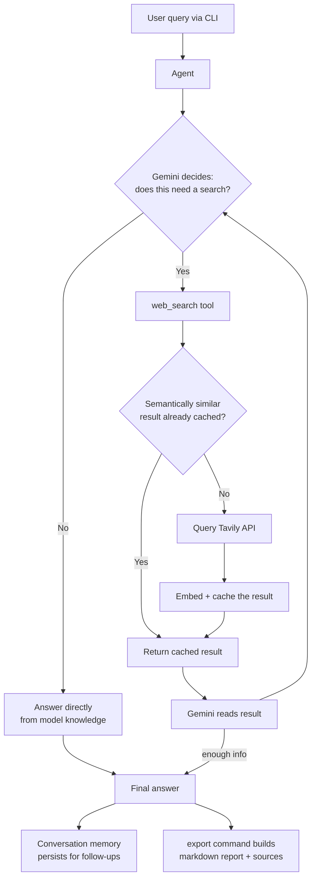

# Delve

**An agentic, conversational research engine that searches, remembers, and cites its sources — from your terminal.**

Delve isn't a search-and-summarize script. It's an LLM agent that decides for itself *when* a question needs a live web search, iterates on its own queries if the first search isn't enough, remembers context across a conversation, builds a growing local knowledge base as it's used, and can export any research session into a clean, cited markdown report.

```
you> what are electric vehicle tax credits in 2026?

  🔍 searching: electric vehicle tax credits 2026 IRS 30D
  🔍 searching: One Big Beautiful Bill Act EV tax deduction 2026

╭─────────────────────────────── Delve ───────────────────────────────╮
│ The federal EV tax credit landscape changed significantly following │
│ the One Big Beautiful Bill Act (OBBBA)...                           │
╰───────────────────────────────────────────────────────────────────╯

you> what about the used EV credit?

╭─────────────────────────────── Delve ───────────────────────────────╮
│ The $4,000 used EV credit (Section 25E) also expired for vehicles   │
│ acquired after September 30, 2025...                                │
╰───────────────────────────────────────────────────────────────────╯

you> export
Saved report to reports/delve_report_20260730_210806.md
```

---

## Why this exists

Most "AI search" demos are a single API call wrapped in a prompt: stuff some search results into context, ask the model to summarize, done. Delve is built differently — it's an **agent with a tool**, not a pipeline with a fixed shape. The model itself decides whether a question needs external information, how to phrase the search, whether one search was enough or it needs to dig further, and it does all of this while holding a real conversation and building a persistent memory of what it's already learned.

That distinction — agent-directed tool use vs. a fixed retrieve-then-generate pipeline — is what makes this closer to how tools like Perplexity actually work under the hood, rather than a toy RAG demo.

---

## Features

- 🔎 **Agentic web search** — the model decides on its own when a question needs current information, and searches only then (not on every message)
- 🔁 **Multi-hop research** — if one search isn't enough, the agent refines its query and searches again, up to a configurable limit
- 💬 **Multi-turn memory** — follow-up questions ("what about the second one?") correctly resolve against earlier context
- 💾 **Local semantic cache** — every search result is embedded and cached; semantically similar future questions ("EV incentives" vs. "electric vehicle tax credits") reuse cached results instead of burning another API call
- 📄 **Exportable reports** — turn any research session into a clean markdown document with a deduplicated, properly cited sources list
- 🛡️ **Resilient by design** — automatic retry with backoff on transient API failures, so a temporary server hiccup doesn't crash the app
- 💸 **Runs entirely on free tiers** — no paid API required for any component

---

## Architecture



The core design principle: **the LLM is the orchestrator, not the pipeline.** Gemini decides when to call the search tool and when it has enough information to stop — including calling it multiple times in a row to refine a query — via the Gemini API's native function-calling (tool-use) support, not hand-written control-flow logic.

---

## Tech stack

| Layer | Technology | Why |
|---|---|---|
| Language | Python 3.12 | |
| LLM / agent reasoning | [Google Gemini API](https://ai.google.dev) (`gemini-3.5-flash-lite`) | Free tier, native function calling, strong reasoning-to-cost ratio |
| Web search | [Tavily API](https://tavily.com) | Purpose-built for LLM agents — clean, pre-extracted content instead of raw HTML |
| Local embeddings | [sentence-transformers](https://www.sbert.net/) (`all-MiniLM-L6-v2`) | Runs fully offline/local, no API cost, powers semantic cache matching |
| Local storage | SQLite | Zero-config persistent cache for the growing knowledge base |
| CLI / UX | [rich](https://github.com/Textualize/rich) | Formatted panels, live status spinners, clean terminal output |
| Web API | [FastAPI](https://fastapi.tiangolo.com) + [uvicorn](https://www.uvicorn.org) | Session-based HTTP access to the same agent that powers the CLI |
| Config | python-dotenv | Environment-based secrets management, keys never touch source control |

No paid services, no cloud infrastructure, no framework overhead — every dependency is doing real, necessary work.

---

## Project structure

```
delve/
├── main.py                    # CLI entry point
├── api.py                     # FastAPI backend entry point
├── config.py                  # env vars, model settings, validation
├── logging_config.py          # structured logging setup
├── requirements.txt
├── requirements-dev.txt        # test/lint/type-check tooling
├── pyproject.toml              # ruff, mypy, pytest config
├── playground.ipynb           # scratch notebook for experimentation only
├── tests/                      # automated test suite (mocks all external APIs)
├── .github/workflows/ci.yml    # lint + type-check + test on every push
└── src/
    ├── cli.py                 # interactive REPL: commands, formatting, I/O
    ├── agent.py                # Agent class — owns the conversation, handles retries
    ├── tools/
    │   └── search.py           # web_search tool factory: checks cache, falls back to Tavily
    ├── memory/
    │   └── conversation.py     # wraps a persistent Gemini chat session
    ├── storage/
    │   ├── embeddings.py       # local embedding model wrapper
    │   └── cache.py             # SQLite-backed semantic cache
    └── reports.py               # builds exportable markdown reports + citations
```

---

## Getting started

### 1. Clone and set up a virtual environment

```bash
git clone https://github.com/RockYash9/delve.git
cd delve
python -m venv .venv
source .venv/bin/activate        # Windows: .venv\Scripts\Activate.ps1
```

### 2. Install dependencies

```bash
pip install -r requirements.txt
```

> First install pulls in PyTorch (for local embeddings) — this is a genuinely large download and can take a few minutes. That's expected.

### 3. Get free API keys (no credit card required for either)

| Key | Where to get it | Free tier |
|---|---|---|
| `GEMINI_API_KEY` | [aistudio.google.com](https://aistudio.google.com) | Generous daily request limit |
| `TAVILY_API_KEY` | [tavily.com](https://tavily.com) | 1,000 searches/month |

```bash
cp .env.example .env
# then edit .env and paste in both keys
```

### 4. Run it

```bash
python main.py
```

**Note:** the very first search will also download the local embedding model (~90MB, one-time, cached afterward automatically).

---

## Usage

Once running, just type a question. A few built-in commands:

| Command | What it does |
|---|---|
| `help` | List all available commands |
| `reset` | Start a fresh conversation — clears conversational memory, but keeps the accumulated knowledge cache |
| `export` | Save the current conversation as a markdown report (transcript + cited sources) to `reports/` |
| `exit` / `quit` | Leave |

---

## Web API

Alongside the CLI, the same agent is also reachable over HTTP — this is the first step toward a full web frontend (in progress).

```bash
uvicorn api:app --reload
```

Interactive docs (auto-generated by FastAPI) at `http://127.0.0.1:8000/docs`.

| Endpoint | Method | Purpose |
|---|---|---|
| `/chat` | POST | Send a message. Include `session_id` to continue an existing conversation, or omit it to start a new one (the response includes the `session_id` to reuse) |
| `/reset` | POST | Clear a session's conversation memory |
| `/export/{session_id}` | GET | Get the session's conversation as a markdown report with sources |
| `/health` | GET | Liveness check |

```bash
curl -X POST http://127.0.0.1:8000/chat \
  -H "Content-Type: application/json" \
  -d '{"message": "what are electric vehicle tax credits in 2026?"}'
```

**A note on isolation**: each session gets its own agent instance and its own search-citation tracking — one user's conversation and sources never leak into another's, even when many sessions run concurrently. Sessions currently live in memory only (restarting the server clears them); persistent storage is a planned upgrade.

---

## How the semantic cache works

Every time the agent searches the web, the query and result are embedded using a local model and stored in SQLite. On future searches, the new query is embedded and compared against everything previously cached using cosine similarity. If something sufficiently close (similarity ≥ 0.75) already exists, it's reused instantly instead of spending a live API call — meaning **the tool gets faster and cheaper to run the more you use it**, and accumulates a genuine local knowledge base over time rather than staying purely a stateless search wrapper.

---

## Development

This project uses automated tests, linting, and type checking — a GitHub Actions workflow (`.github/workflows/ci.yml`) runs all three on every push.

```bash
pip install -r requirements-dev.txt

pytest -v          # run the test suite
ruff check .        # lint
mypy .               # type check
```

Tests mock all external APIs (Gemini, Tavily, the embedding model) — the suite runs fully offline and never needs real API keys, so it's safe to run in CI or anywhere else.

Logs are written to `logs/delve.log` (rotated automatically) — useful for understanding agent behavior after the fact, separate from the live terminal UI.

## Known limitations

- Gemini's free-tier models are occasionally retired or renamed by Google with little notice — if you hit a `404` on the configured model, check [ai.google.dev/gemini-api/docs/changelog](https://ai.google.dev/gemini-api/docs/changelog) and update `MODEL_NAME` in `config.py`.
- The semantic cache has no expiration — for fast-changing topics (news, prices), a stale cached result could be served if it's semantically close enough. A time-based cache invalidation policy is a natural next improvement.
- Free-tier rate limits apply on both Gemini and Tavily; heavy usage may require upgrading either.

---

## Roadmap

- [x] Working LLM integration with resilient retry handling
- [x] Agent-directed web search via native tool-calling
- [x] Multi-turn conversational memory
- [x] Local semantic caching of search results
- [x] Exportable, cited research reports
- [x] Automated tests, linting, type checking, and CI
- [x] Structured logging separate from user-facing output
- [x] FastAPI backend wrapping the agent, session-based
- [ ] Source credibility scoring / filtering
- [ ] Persistent user profiles across sessions
- [ ] Configurable cache expiration for time-sensitive topics
- [ ] Streaming responses + web frontend
- [ ] Free public deployment

---

## License

No license has been set yet — all rights reserved by default.